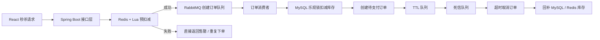

# GreatMall 高并发秒杀电商平台

独立开源项目骨架，聚焦真实秒杀业务的核心链路设计，覆盖商品详情缓存、Redis + Lua 库存预扣减、RabbitMQ 异步下单、死信超时取消，以及 MyBatis-Plus 乐观锁库存回源扣减。

## 技术栈

- 后端：Spring Boot 3、MyBatis-Plus、MySQL 8、Redis 7、RabbitMQ 3
- 前端：React 18、Vite 5
- 关键能力：Lua 原子扣减、布隆过滤器、随机过期时间、异步削峰、死信关闭订单、乐观锁防超卖

## 项目亮点

- 秒杀主链路：请求先进入 Redis，使用 Lua 脚本完成库存预扣减和一人一单原子校验，再投递到 RabbitMQ 异步创建订单。
- 削峰填谷：数据库写入不直接暴露给突发请求，订单落库改为消费者串接处理，适合在简历中展示消息队列削峰架构。
- 超时取消：订单创建成功后进入 TTL 队列，超时未支付会转入死信队列，自动取消订单并回补 Redis / MySQL 库存。
- 缓存防灾：商品详情使用缓存旁路模式，TTL 引入随机抖动；商品是否存在先过布隆过滤器，降低缓存穿透风险。
- 防止超卖：数据库库存最终扣减使用 MyBatis-Plus 乐观锁回源，避免并发写入导致库存穿透。

## 架构流程



## 目录结构

```text
.
├─ backend                Spring Boot 后端
├─ frontend               React 前端
├─ sql                    MySQL 初始化脚本
└─ docker-compose.yml     MySQL / Redis / RabbitMQ 本地依赖
```

## 快速启动

### 1. 启动依赖服务

```bash
docker compose up -d
```

如果本机没有 Docker，也可以分别手动启动 MySQL、Redis、RabbitMQ，并保持以下默认配置：

- MySQL：`localhost:3306`，库名 `greatmall`
- Redis：`localhost:6379`
- RabbitMQ：`localhost:5672`

### 2. 启动后端

```bash
cd backend
mvn spring-boot:run
```

后端默认端口：`8080`

### 3. 启动前端

```bash
cd frontend
npm install
npm run dev
```

前端默认端口：`5173`

## 核心接口

- `GET /api/products`：查询商品列表
- `GET /api/products/{productId}`：查询商品详情
- `POST /api/seckill/{productId}`：提交秒杀请求
- `GET /api/orders?userId=10001`：查询用户订单
- `POST /api/orders/{orderNo}/pay`：模拟支付

秒杀请求体示例：

```json
{
  "userId": 10001
}
```

## 关键实现说明

### 1. Redis + Lua 原子预扣减

- `backend/src/main/resources/lua/seckill_deduct.lua`
- 原子完成三件事：读取库存、校验是否重复下单、扣减库存并记录用户集合。

### 2. RabbitMQ 异步下单

- `greatmall.order.create.queue`：处理异步创建订单
- `greatmall.order.ttl.queue`：承接待关闭订单 TTL
- `greatmall.order.cancel.queue`：死信转发后的超时取消队列

### 3. 乐观锁防超卖

- `Product.version` 字段启用 MyBatis-Plus 乐观锁插件
- 数据库最终扣减库存发生在消费者中，避免直接在接口层对 MySQL 打满写压力

### 4. 缓存与布隆过滤

- 商品详情按 `greatmall:product:detail:{productId}` 缓存
- TTL 引入 `20~29` 分钟随机值
- 商品 ID 启动时写入 Redisson BloomFilter，降低恶意 ID 穿透数据库

## 压测说明

本仓库已实现支撑简历描述所需的关键技术方案，但当前提交没有在这个会话里实际跑 Redis / RabbitMQ / MySQL 联调压测，因此：

- `QPS 3000+`
- `落库写压力降低 90%+`

这两项需要你在本机或服务器环境中结合 JMeter、wrk 或 k6 再做实测，并把结果补入 README 或简历。项目结构已经为这类压测准备好了秒杀主链路和异步削峰架构。

## 后续可扩展方向

- 接入 JWT 登录与真实用户体系
- 增加支付回调、库存流水、订单补偿任务
- 引入监控指标、链路追踪、热点参数限流
- 增加 Prometheus + Grafana 压测观测面板
